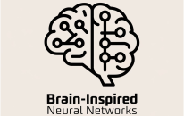

# Brain-inspired Neural Networks

[](https://www.python.org/)
[](https://pytorch.org/)
[](LICENSE)

Brain-inspired Neural Networks is a **Spiking Neural Network** library based on PyTorch, designed to simulate the working mechanisms of the brain and provide powerful tools for research and development.

## 1. Prerequisites

- matplotlib==3.4.0
- numpy==1.25.0
- torch==2.0.1
- torchvision==0.15.2

```bash
pip3 install -r requirements.txt
```

## 2. Quick Start

The following tutorials can be found in the `examples` folder：

- **MNIST example:**

  In this task, we replace ALIF (Astrocyte Leaky Integrateand-Fire) neurons with LIF neurons . The comment code is available for experimentation, allowing users to compare the effects of LIF and ALIF neurons in MNISTNet.

```python
class MNISTNet(nn.Module):  # Example net for MNIST
  def __init__(self):
    super(MNISTNet, self).__init__()
    self.conv1 = snn.Conv2d(1, 32, 3, 1, 1)
    self.pool1 = snn.AvgPool2d(2)
    self.conv2 = snn.Conv2d(32, 32, 3, 1, 1)
    self.pool2 = snn.AvgPool2d(2)
    self.fc1 = snn.Linear(7 * 7 * 32, 300)
    self.fc2 = snn.Linear(300, 10)
    # self.spike = snn.LIF_Spike()
    self.spike = snn.ALIF_Spike()
```

- **Time-series regression example**

  In the task of time-series regression, we implemented the ASLSTM (Astrocyte Spiking Long Short-term Memory) and compared it with the standard LSTM from PyTorch's built-in implementation. 

```python
class Net(nn.Module):
  def __init__(self):
    super().__init__()
    self.hidden = 128
    self.lstm1 = snn.ASLSTMCell(1, self.hidden)
    self.lstm2 = snn.ASLSTMCell(self.hidden, self.hidden, output=True)
    self.linear = nn.Linear(self.hidden , 1)
 
class ANN_LSTM(nn.Module):
    def __init__(self):
        super(ANN_LSTM, self).__init__()
        self.lstm1 = nn.LSTMCell(1, 128)
        self.lstm2 = nn.LSTMCell(128, 128)
        self.linear = nn.Linear(128, 1)
```


## 3. Citation

If our work inspires your research or some part of the codes are useful for your work, please cite our paper: [NeuroVE: Brain-Inspired Linear-Angular Velocity Estimation With Spiking Neural Networks](https://arxiv.org/html/2408.15663v1)

```latex
@ARTICLE{10839327,
  author={Li, Xiao and Chen, Xieyuanli and Guo, Ruibin and Wu, Yujie and Zhou, Zongtan and Yu, Fangwen and Lu, Huimin},
  journal={IEEE Robotics and Automation Letters}, 
  title={NeuroVE: Brain-Inspired Linear-Angular Velocity Estimation With Spiking Neural Networks}, 
  year={2025},
  volume={10},
  number={3},
  pages={2375-2382},
  keywords={Estimation;Encoding;Neurons;Cameras;Feature extraction;Circuits;Brain modeling;Membrane potentials;Numerical models;Integrated circuit modeling;Neurorobotics;bioinspired robot learning;SLAM},
  doi={10.1109/LRA.2025.3529319}
}
```


## 4. Contact

If you have any questions or opinions, feel free to raise them by creating an 'issue' in this repository, or contact us via lx852357@outlook.com, lhmnew@nudt.edu.cn or yufangwen@tsinghua.edu.cn.


